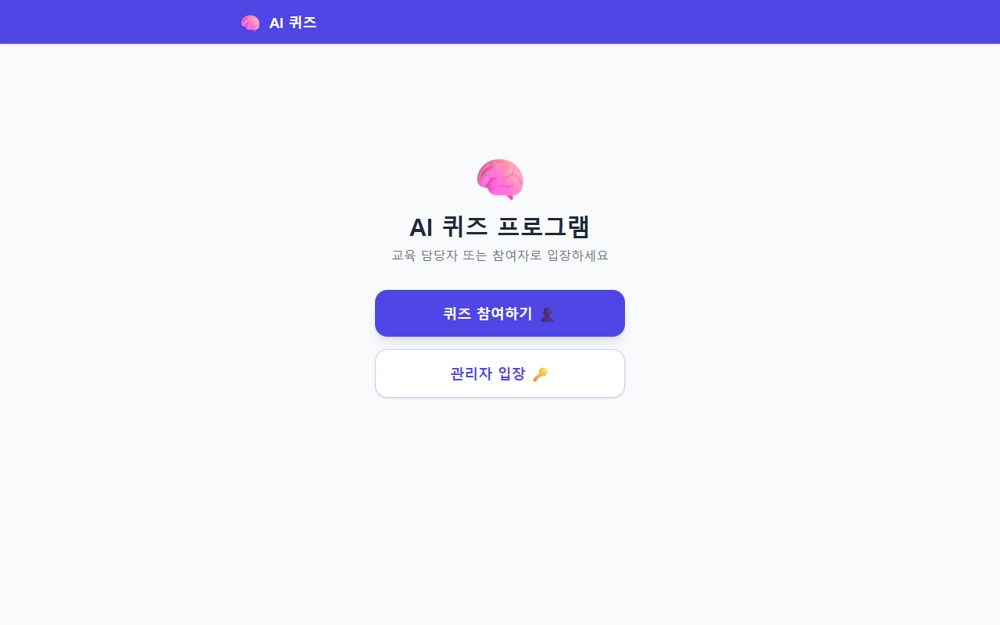
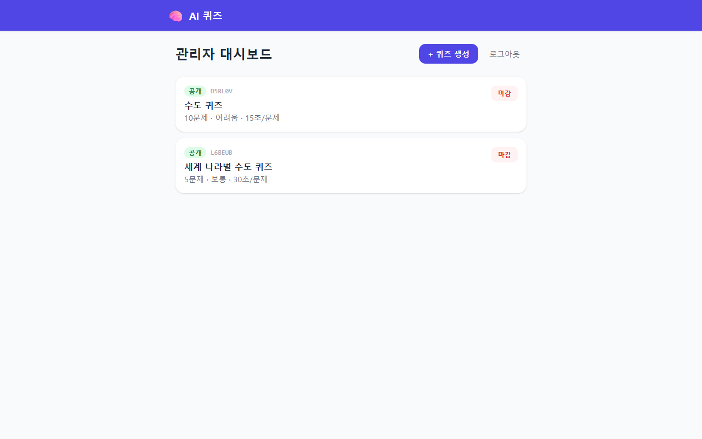
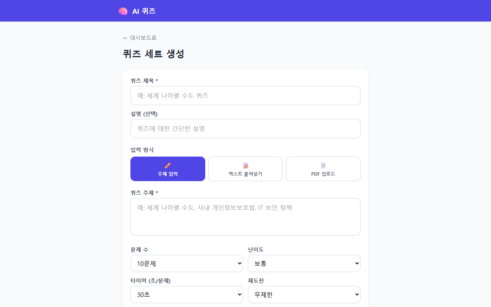
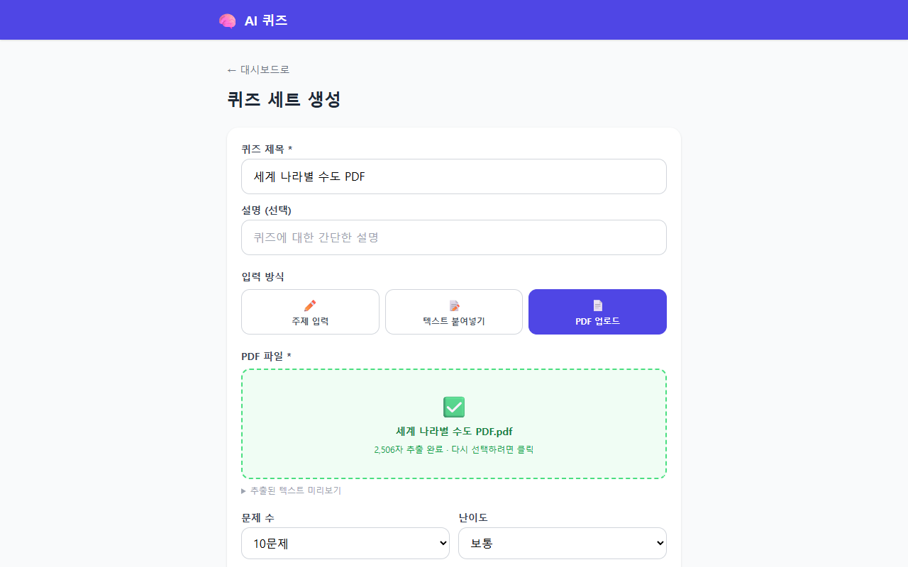
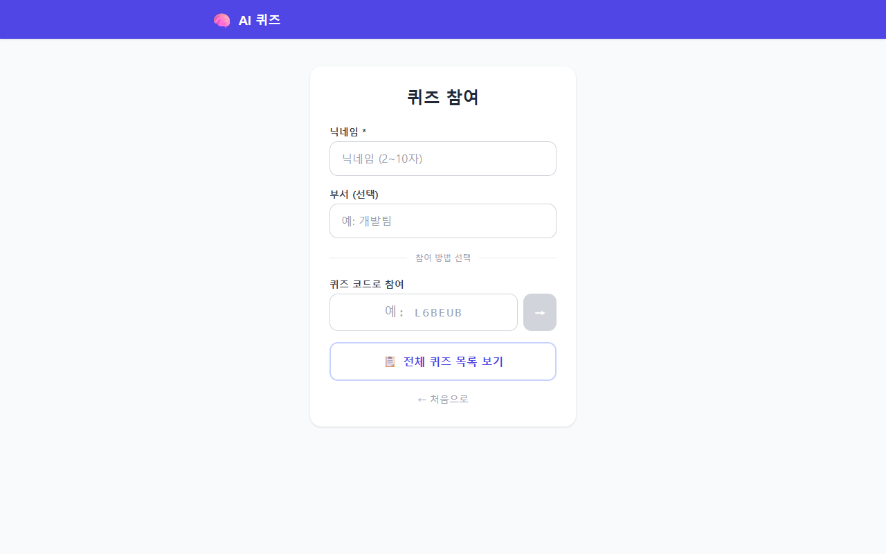
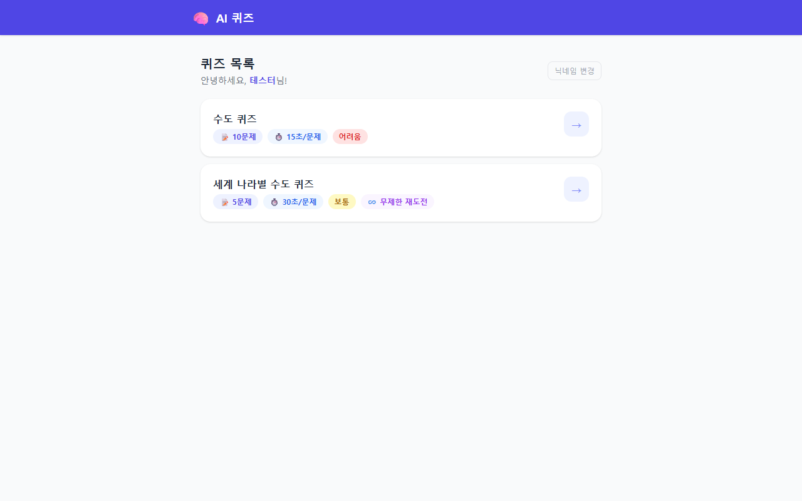
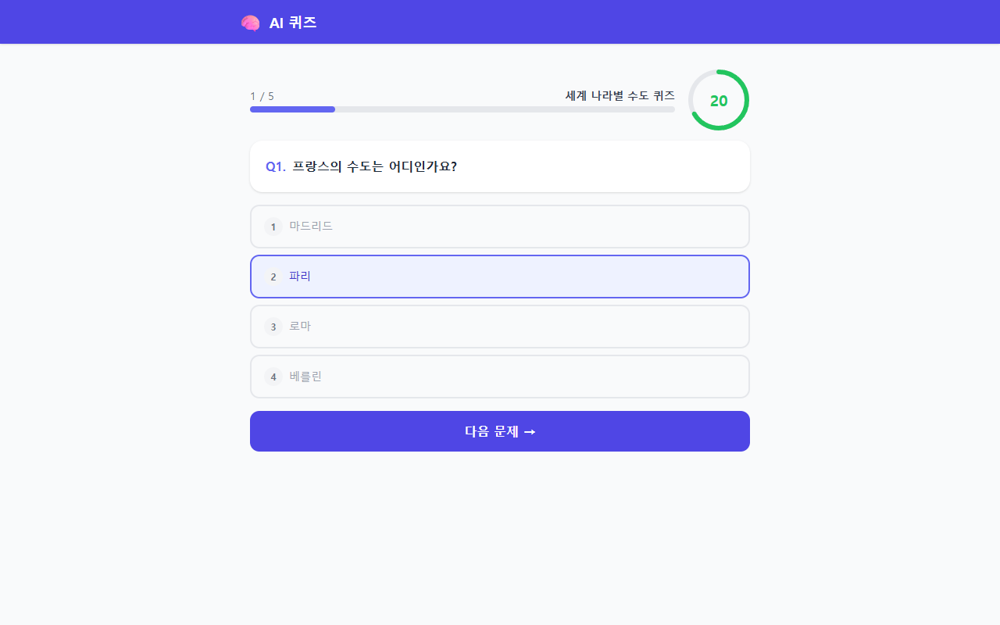
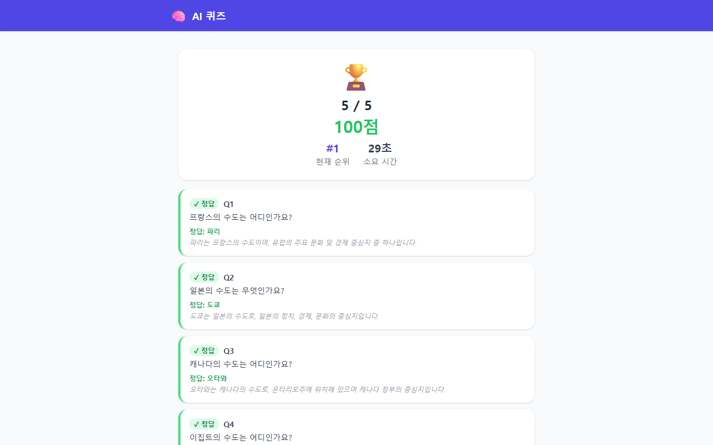
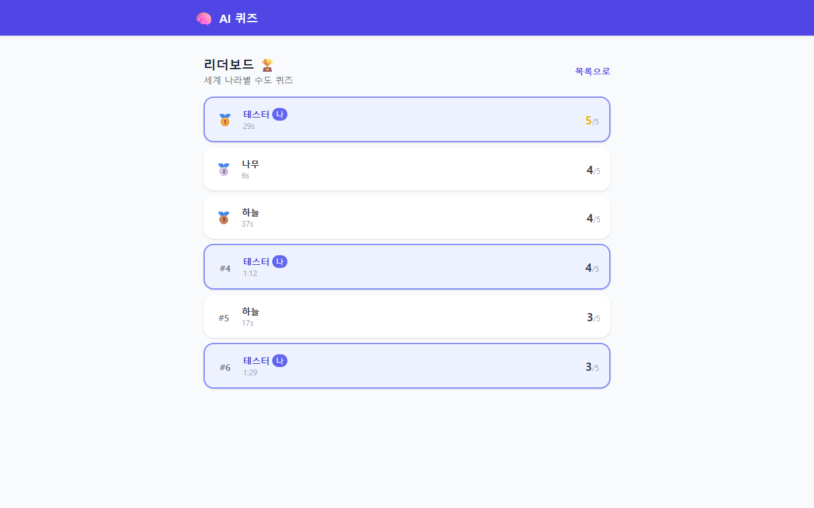

# 🧠 AI 퀴즈 프로그램

OpenAI GPT와 Firebase를 기반으로 한 사내 교육용 AI 퀴즈 플랫폼입니다.  
교육담당자가 주제·텍스트·PDF를 입력하면 AI가 자동으로 문제를 생성하고, 임직원은 타이머 기반 퀴즈를 풀며 실시간 리더보드에서 순위를 확인할 수 있습니다.

---

## 스크린샷

### 홈 화면
역할(참여자 / 관리자)을 선택해 입장합니다.



---

### 관리자 대시보드
생성된 퀴즈 세트를 한눈에 확인하고 공개/마감을 토글합니다.



---

### 퀴즈 생성 — 주제/텍스트 입력



---

### 퀴즈 생성 — PDF 업로드
PDF 파일을 업로드하면 클라이언트에서 직접 텍스트를 추출 후 AI에게 전달합니다.



---

### 참여자 입장
닉네임 입력 후 퀴즈 코드로 바로 참여하거나, 전체 목록에서 선택할 수 있습니다.



---

### 퀴즈 목록
공개된 퀴즈를 난이도·문제 수·타이머 정보와 함께 확인합니다.



---

### 퀴즈 진행 — 타이머 포함
원형 프로그레스 타이머가 실시간으로 줄어들며, 시간 초과 시 자동 오답 처리됩니다.



---

### 결과 화면
점수·정답률·순위·풀이 시간과 문제별 정오답·해설을 확인합니다.



---

### 리더보드
점수 내림차순 → 풀이 시간 오름차순으로 정렬되며, 내 항목이 하이라이트됩니다.



---

## 주요 기능

| 구분 | 기능 |
|------|------|
| **관리자** | 퀴즈 세트 생성 (주제 / 텍스트 / PDF), 문제 검토 및 편집, 공개 코드 발급, 공개/마감 토글 |
| **참여자** | 코드 입력 또는 목록에서 선택, 타이머 카운트다운 퀴즈 진행, 결과 확인 |
| **리더보드** | Firebase 실시간 구독, 점수·시간 복합 정렬, 상위 50명, 내 항목 하이라이트 |
| **AI** | OpenAI API 직접 호출, 객관식 4지선다, 난이도·문제 수 설정 가능 |
| **PDF** | 클라이언트 사이드 텍스트 추출 (pdfjs-dist), 최대 10MB · 24,000자 |

---

## 기술 스택

| 항목 | 기술 |
|------|------|
| 프론트엔드 | React 18 + TypeScript, Vite, Tailwind CSS |
| 상태 관리 | Zustand |
| 라우팅 | React Router v6 |
| 데이터베이스 | Firebase Firestore (실시간) |
| 파일 스토리지 | Firebase Storage |
| AI | OpenAI API (모델: `.env`의 `VITE_OPENAI_MODEL`) |
| PDF 파싱 | pdfjs-dist |

---

## 빠른 시작

### 1. 저장소 클론 및 설치

```bash
git clone <repo-url>
cd ai-quiz
npm install
```

### 2. 환경 변수 설정

프로젝트 루트에 `.env` 파일을 생성합니다.

```env
# Firebase
VITE_FIREBASE_API_KEY=your_api_key
VITE_FIREBASE_AUTH_DOMAIN=your_project.firebaseapp.com
VITE_FIREBASE_PROJECT_ID=your_project_id
VITE_FIREBASE_STORAGE_BUCKET=your_project.firebasestorage.app
VITE_FIREBASE_MESSAGING_SENDER_ID=your_sender_id
VITE_FIREBASE_APP_ID=your_app_id

# 관리자 비밀번호 (MVP — 사내망 전용 운영 권장)
VITE_ADMIN_PASSWORD=your_admin_password

# OpenAI
VITE_OPENAI_API_KEY=sk-proj-...
VITE_OPENAI_MODEL=gpt-4.5
```

> ⚠️ `.env` 파일은 절대 Git에 커밋하지 마세요. `.gitignore`에 포함되어 있습니다.

### 3. Firebase Firestore 규칙 배포

[Firebase Console → Firestore → 규칙](https://console.firebase.google.com)에서 아래 규칙을 적용합니다.

```
rules_version = '2';
service cloud.firestore {
  match /databases/{database}/documents {
    match /{document=**} {
      allow read, write: if true;  // MVP — 사내망 전용 운영
    }
  }
}
```

### 4. 개발 서버 실행

```bash
npm run dev
```

브라우저에서 [http://localhost:5173](http://localhost:5173)을 열어 확인합니다.

---

## 사용 방법

### 관리자 (교육담당자)

1. 홈에서 **관리자 입장** 클릭
2. `.env`의 `VITE_ADMIN_PASSWORD` 입력
3. **+ 퀴즈 생성** → 주제·텍스트·PDF 중 선택 → 옵션 설정
4. **🤖 AI 문제 생성** 클릭 (약 10~30초 소요)
5. 생성된 문제 검토 후 **저장 & 공개**
6. 발급된 6자리 코드를 임직원에게 공유

### 임직원 (참여자)

1. 홈에서 **퀴즈 참여하기** 클릭
2. 닉네임 입력 (선택: 부서)
3. 코드가 있으면 코드 입력 → **→** 클릭  
   없으면 **전체 퀴즈 목록 보기** 클릭
4. 타이머 내에 답변 선택 → 자동으로 다음 문제 이동
5. 마지막 문제 제출 → 점수·순위 확인
6. **리더보드** 버튼으로 전체 순위 확인

---

## 타이머 UI 규칙

| 남은 시간 | 색상 | 효과 |
|-----------|------|------|
| 50% 초과 | 🟢 초록 | 없음 |
| 10~50% | 🟡 노랑 | 없음 |
| 10% 미만 | 🔴 빨강 | 테두리 깜빡임 + 진동 애니메이션 |
| 0초 | 🔴 빨강 | "시간 초과!" 표시 후 자동 이동 |

---

## 프로젝트 구조

```
ai-quiz/
├── src/
│   ├── components/       # 공통 컴포넌트 (Timer, Layout, AdminRoute)
│   ├── lib/              # Firebase 초기화, PDF 추출
│   ├── pages/            # 라우트별 페이지 컴포넌트
│   ├── services/         # Firestore CRUD + OpenAI 호출
│   ├── store/            # Zustand 전역 상태
│   └── types/            # TypeScript 타입 정의
├── functions/            # Firebase Cloud Functions (선택)
├── docs/                 # 문서 및 스크린샷
├── firestore.rules       # Firestore 보안 규칙
└── firebase.json
```

---

## 개발 로드맵

### Phase 1 — MVP ✅
- [x] Firebase Firestore 연동
- [x] 관리자 비밀번호 인증 (sessionStorage)
- [x] 퀴즈 세트 생성 (주제 / 텍스트 / **PDF**)
- [x] OpenAI API 문제 생성 (객관식)
- [x] 임직원 닉네임 입력 → 퀴즈 진행 → 결과
- [x] 타이머 카운트다운 (자동 오답 처리)
- [x] 실시간 리더보드

### Phase 2 — 예정
- [ ] Firebase Authentication (이메일/비밀번호 + 관리자 역할)
- [ ] 단답형 문제 유형
- [ ] 문제 편집 (순서 드래그앤드롭)
- [ ] 관리자 대시보드 (오답률 분석)
- [ ] QR 코드 생성 및 공유

### Phase 3 — 예정
- [ ] 부서별 리더보드 필터링
- [ ] CSV 데이터 내보내기
- [ ] 모바일 최적화

---

## 보안 주의사항

- `VITE_ADMIN_PASSWORD`는 클라이언트 번들에 포함됩니다. **반드시 사내망(VPN) 환경에서만 운영**하거나 Phase 2에서 Firebase Auth로 전환하세요.
- `VITE_OPENAI_API_KEY`는 클라이언트에서 직접 호출합니다. 프로덕션 환경에서는 Firebase Cloud Functions를 통해 서버 사이드에서 호출하도록 전환하세요 (`functions/src/index.ts` 참고).
- `.env` 파일을 절대 버전 관리에 포함하지 마세요.

---

*AI 퀴즈 v0.1.0 | React 18 + Firebase + OpenAI GPT*
